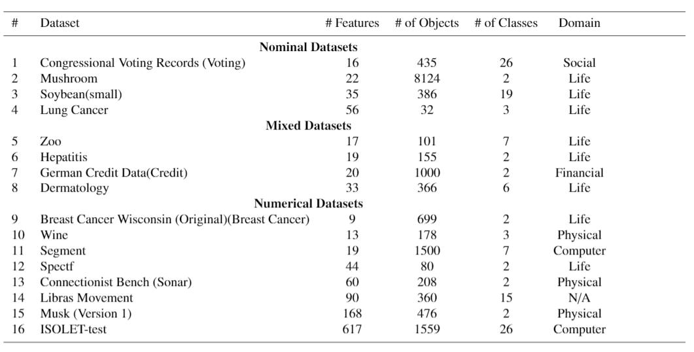

## Datasets Directory

Datasets directory is the place of the datasets that will be used to evaluate the performance of EBCS approach, the source code supports csv file type only. EBCS was evaluated mainly on sixteen datasets that were taken from the UCI repository of machine learning database, to visit the repository and download the datasets, please <a href="https://archive.ics.uci.edu/ml/index.php"> click here </a>. 

The Following table shows the characterstices of the datasets that were used in the evaluation.

